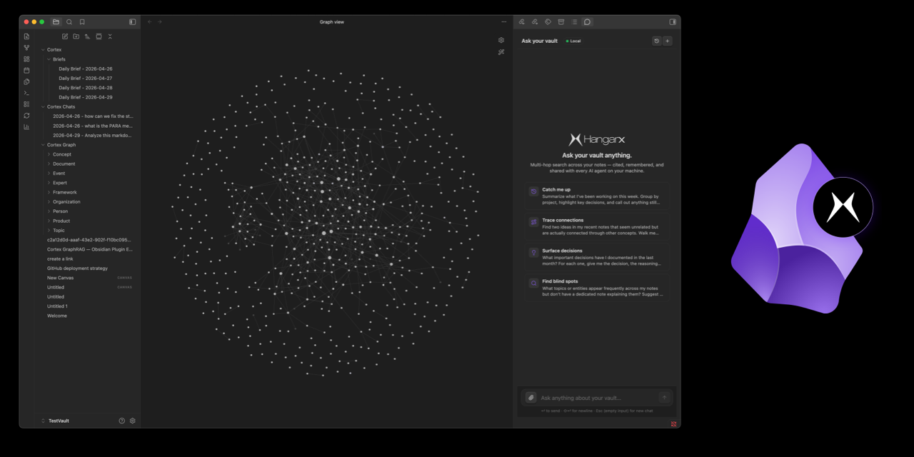

<p align="center">
  
</p>

# HangarX for Obsidian

> Stop re-introducing yourself to your AI.

**HangarX turns your Obsidian vault into shared memory that every AI agent on your machine can query.** Instead of re-explaining your projects to Claude, then to Cursor, then to Claude Code, your notes become a queryable knowledge graph — with entities, relationships, and citations — exposed through the [Model Context Protocol](https://modelcontextprotocol.io) (MCP). Agents can ask questions grounded in your vault, surface related notes, and write new findings back to the graph.

Run it **hosted** (sign in with HangarX, zero setup) or **fully local** (Docker + BYOK for OpenAI, Anthropic, Google, Mistral, Cohere, Groq, Together AI, or Ollama). The plugin ships with: a chat panel that cites the vault notes behind every answer, one-modal two-way sync between vault and graph, live entity highlighting on Obsidian's native graph view, inline wikilink suggestions powered by graph matching, and one-click MCP setup for Claude Desktop, Cursor, Cline, Windsurf, and Claude Code.

📖 [Full docs](https://app.hangarx.ai/obsidian#docs) · 🌐 [Dashboard](https://app.hangarx.ai) · 🐛 [Issues](https://github.com/3-Elements-Design/hangarx-obsidian/issues)

---

## Why

You've already written everything: standups, design docs, half-finished thoughts. The bottleneck isn't capturing knowledge — it's making it usable by the agents you use every day.

- **Claude Desktop forgot what you decided last week.** HangarX remembers.
- **Cursor doesn't know your team's conventions.** HangarX answers from your notes.
- **You repeat yourself across every new chat.** HangarX is the one source of truth they all read.

## Who it's for

- **Note-takers** who want a smarter Q&A surface than the built-in search.
- **Agent power users** running 2+ AI tools that should share context.
- **Teams** with a single vault of decisions, runbooks, and architectural notes.
- **Privacy-first users** who want everything to stay on their laptop (Local mode = no cloud, no data leaves your machine).

---

## What it does

| | |
|---|---|
| 💬 **Ask your vault** | Multi-hop chat with citations back to the source notes. Lives in the right sidebar. |
| 🌐 **Native graph integration** | Push chat answers into Obsidian's built-in Graph view — non-matching nodes dim, cited entities stay highlighted. |
| 🔄 **Two-way sync** | Push notes to the graph, pull graph entities back as markdown, or diff the two sides to see what's drifted. |
| 🤖 **MCP bridge** | One-click connect to Claude Desktop, Claude Code, Cursor, Cline, Windsurf — they get tools to query your vault. |
| ✨ **Inline link suggestions** | Ghost-text `[[wikilinks]]` while you type, driven by entity matches in your graph. |
| 🔒 **Local or cloud** | Cloud is one-click OAuth. Local runs everything in Docker on your laptop. |

---

## Install

**Community plugins (recommended).**

1. Settings → **Community plugins → Browse**
2. Search **"HangarX"** → **Install** → **Enable**
3. The first-run onboarding modal walks you through Cloud / Local setup.

<details>
<summary><strong>Other install options</strong></summary>

**BRAT (beta builds).**
Install [BRAT](https://github.com/TfTHacker/obsidian42-brat), then **Add beta plugin** → paste `https://github.com/3-Elements-Design/hangarx-obsidian`.

**Manual.**
Grab `main.js`, `manifest.json`, `styles.css` from the [latest release](https://github.com/3-Elements-Design/hangarx-obsidian/releases) and drop them in `<your-vault>/.obsidian/plugins/hangarx-obsidian/`. Reload Obsidian, enable in Community Plugins.

</details>

---

## Quick start

### Cloud — 60 seconds

Best for trying HangarX out. Sign-in is OAuth, no key copy-paste.

1. Settings → **HangarX → Connection** → Mode: **Cloud (hosted)**
2. **Sign in with HangarX** → approve in browser → API key + workspace auto-fill
3. Command palette (⌘P / Ctrl-P) → **Sync**
4. Open the **Ask your vault** chat in the right sidebar and ask anything

### Local — fully private

Everything runs in Docker on your machine. Notes never leave the laptop.

1. Settings → **HangarX → Connection** → Mode: **Local (docker)**
2. Add at least one LLM key in **LLM provider keys** (Gemini, OpenAI, Anthropic, Kimi, HuggingFace, OpenRouter, xAI, or Ollama for fully offline)
3. Click **Save to vault** — writes `docker-compose.cortex.yml` next to your notes with your keys baked in
4. In a terminal: `docker compose -f docker-compose.cortex.yml up -d`
5. Run **Sync** from the command palette

> Requires [Docker Desktop](https://www.docker.com/products/docker-desktop/). Images are pulled from Docker Hub (`hangarx/cortex-api`) — no source code or Node.js needed.

#### Hand step 4 to Claude Code (or any LLM agent)

After step 3, instead of opening a terminal yourself, paste this prompt into Claude Code, Cursor, Cline, or any agentic coding assistant. It handles Docker checks, startup, health-polling, and troubleshooting.

```text
You're helping me bring up the HangarX local stack for the Obsidian plugin
(https://community.obsidian.md/plugins/hangarx). Be terse — one update
per phase, no narration.

1. Find docker-compose.cortex.yml at the root of my Obsidian vault. Ask
   me for my vault path if you can't infer it. If the file doesn't
   exist, stop and tell me to open Obsidian → Settings → HangarX →
   Local mode → click "Save to vault" in step 2, then re-run this prompt.

2. Verify Docker is ready: `docker --version` and `docker ps` both
   succeed. If Docker Desktop isn't installed, point me to
   https://www.docker.com/products/docker-desktop/ and stop. If it's
   installed but not running, launch it (`open -a Docker` on macOS) and
   wait until `docker ps` succeeds before continuing.

3. cd to my vault and run:
   docker compose -f docker-compose.cortex.yml up -d
   First run pulls hangarx/cortex-api, falkordb/falkordb, and
   pgvector/pgvector:pg16 — expect a few minutes.

4. Poll `curl -sf http://127.0.0.1:3400/health` every 3 seconds for up
   to 90 seconds. If it doesn't come up, show me the last 30 lines of
   `docker compose -f docker-compose.cortex.yml logs cortex-api`.

5. Once healthy, tell me to open Obsidian's command palette and run
   "HangarX: Sync". The plugin's settings page will flip from the
   three-step wizard to "✓ Local stack running" on its next probe
   (Retry button on the connection status pill if it doesn't refresh).

If anything fails:
- Port 3400 in use → `lsof -i :3400` to see who's using it. Either
  stop that process or change CORTEX_PORT in the compose file and
  re-run with `up -d --force-recreate`.
- cortex-api exits immediately → check the logs. Most common: missing
  LLM provider key (re-save the YAML from Obsidian with a key
  configured) or Postgres healthcheck failing on first boot
  (`docker compose down -v` and retry).

Don't generate the docker-compose file yourself — the plugin owns it
(encryption keys + provider keys are baked in by Obsidian so re-saves
stay in sync). If the file is missing or broken, hand control back to
the plugin's "Save to vault" button.
```

> The same prompt is available as a "Copy LLM setup prompt" button next to the docker command in step 3 of the plugin's local setup wizard.

---

## How it works

```
┌──────────────┐       ┌──────────────┐       ┌──────────────────┐
│  Your vault  │  ──►  │  Cortex API  │  ──►  │ Knowledge graph  │
│  (markdown)  │       │  (entity     │       │  FalkorDB +      │
│              │       │  extraction) │       │  pgvector        │
└──────────────┘       └──────────────┘       └──────────────────┘
                              ▲                        ▲
                              │                        │
                       ┌──────┴────────┐       ┌───────┴────────┐
                       │ Obsidian      │       │ External agents│
                       │ chat panel    │       │ (Claude, Cursor│
                       │ + graph view  │       │  Cline, etc.)  │
                       └───────────────┘       └────────────────┘
```

1. **Sync** parses your notes, extracts entities (people, projects, concepts) + relationships, and stores them as a graph alongside vector embeddings.
2. **Ask** runs multi-hop retrieval (graph traversal + semantic search + reranking) over that graph and an LLM composes the answer with citations.
3. **MCP bridge** exposes the same retrieval tools to external agents over a local protocol — they query your vault the same way the in-Obsidian chat does.

---

## Connect external agents

Settings → **Agents** shows every supported harness:

| Agent | One-click |
|---|---|
| Claude Desktop, Claude Code, Cursor, Cline, Windsurf | ✅ |
| Zed, Goose, Codex CLI, custom MCP clients | Copy JSON snippet |

Click **Connect** and HangarX merges its MCP server entry into the agent's config (non-destructively — your other MCP servers stay). Restart the agent and it gets the tools below.

> **Two MCP surfaces:** the **plugin bridge** (loopback HTTP at `127.0.0.1:7474`, behind a bearer token) is what the one-click connect wires up — a focused toolset tuned for vault-side workflows including a handful of tools (sync, dedupe, active-note) that only work with direct vault access. The **Cortex API** also speaks MCP and exposes a larger surface (50+ tools — workflows, custom tools, advanced search variants, live event streams) for agents that connect to it directly. Most users only need the plugin bridge.

### Plugin bridge tools (what one-click agents see)

These are what Claude Desktop / Cursor / Cline / etc. see in their tool listings after you click Connect.

#### Ask + retrieve

| Tool | What the agent can do |
|---|---|
| `cortex_ask` | Synthesized Q&A grounded in your vault — multi-hop retrieval + citations |
| `cortex_recall` | Search both agent memories AND the vault graph; results tagged by source so the agent can distinguish |
| `cortex_search_entities` | Find entities by name + optional type (Person, Project, Concept, …) |
| `cortex_stats` | Graph totals + per-type entity / relationship breakdowns |

#### Workspace awareness (plugin-only — needs vault access)

| Tool | What the agent can do |
|---|---|
| `cortex_active_note` | Path, content, and frontmatter of the markdown file open right now — "tell me about this note" without naming it |
| `cortex_recent_notes` | Most-recently-modified notes — temporal context for "what have you been working on?" |
| `cortex_get_note` | Full content + outgoing links + backlinks for one note by vault path |

#### Graph exploration

| Tool | What the agent can do |
|---|---|
| `cortex_related` | Notes related to a given note via wikilinks, embeddings, or extracted entities |
| `cortex_paths` | Shortest paths between two entities — multi-hop graph reasoning |
| `cortex_suggest_links` | Wikilink suggestions driven by entity matching |
| `cortex_contradictions` | Surface inconsistencies across notes |

#### Memory + writes

| Tool | What the agent can do |
|---|---|
| `cortex_remember` | Persist a fact / decision / insight. Auto-merges caller frontmatter (aliases, tags, links) into the file and ingests the result into the graph so it's immediately retrievable. |
| `cortex_delete_note` | Soft-delete a note (OS trash by default; `permanent: true` opt-in). Cascades cleanup through graph + sync index. |
| `cortex_ingest_url` | Scrape a URL and add it to the graph as a new document |

#### Sync + recovery (plugin-only — needs vault access)

| Tool | What the agent can do |
|---|---|
| `cortex_sync` | Full or path-scoped vault sync. `force: true` bypasses the per-file hash check — use after a graph reset. Surfaces `serverGraphEmpty: true` + a recovery hint when the local index thinks everything's synced but the server graph is empty. |
| `cortex_sync_status` | Pending changes, last-sync time, drift detection — diagnose before you trigger sync |
| `cortex_rebuild` | Async embedding backfill + community detection. Returns a `jobId` immediately; the work runs in background so MCP request timeouts don't matter. |
| `cortex_rebuild_status` | Poll a `cortex_rebuild` job by `jobId` |
| `cortex_dedupe` | Merge duplicate Entity nodes by (workspace, type, name). `dryRun: true` previews the merge plan without mutating. Requires cortex-api 1.0.2+. |

### Cortex API direct connection (advanced)

Agents that bypass the plugin bridge and connect straight to the Cortex API (`cortex.hangarx.ai` for Cloud, `127.0.0.1:3400` for Local) see a larger surface — workflows, custom tools, advanced search variants, live event streams, generative tools. The plugin-only tools above (sync, active-note, etc.) are *not* available on this surface because the Cortex API can't reach into your vault; everything else listed below is.

#### Q&A and unified retrieval

| Tool | What the agent can do |
|---|---|
| `cortex_unified_ask` | Natural-language Q&A grounded in your vault — citations included |
| `cortex_chat` | Multi-turn agentic chat with the full tool loop |
| `cortex_get_context` | Build a hybrid retrieval bundle (entities + chunks + memories) for a query |
| `cortex_unified_search` | One-shot search across entities, documents, and memories |
| `cortex_advanced_search` | Hybrid search with date / tag / entity-type filters |

#### Knowledge-graph exploration

| Tool | What the agent can do |
|---|---|
| `cortex_search_entities` | Find entities by name + optional type (Person, Project, Document, …) |
| `cortex_list_entities` | Paginated entity listing with type filters |
| `cortex_get_entity` | Fetch one entity's full record (properties, type, description) |
| `cortex_get_neighbors` | Expand 1–3 hops out from an entity to see what's connected |
| `cortex_find_paths` | Shortest path between two entities — multi-hop graph reasoning |
| `cortex_explain_entity` | Full profile of one entity in a single call: properties + neighbors + sources |
| `cortex_get_provenance` | Source documents an entity was extracted from — the citation tool |
| `cortex_query_graph` | Run a custom Cypher query (read-only) against the graph |
| `cortex_get_schema` | Introspect the live graph schema (node types, edge types, properties) |
| `cortex_get_communities` | Auto-detected entity clusters / topics |
| `cortex_predict_links` | ML-suggested missing edges between entities |
| `cortex_point_in_time` | Temporal queries — graph state as of a given timestamp |

#### Document retrieval

| Tool | What the agent can do |
|---|---|
| `cortex_search_documents` | Semantic search across your notes |
| `cortex_summarize_document` | LLM summary of a single document |

#### Memory (cross-session)

| Tool | What the agent can do |
|---|---|
| `cortex_remember` | Save a fact / preference / decision to persistent memory |
| `cortex_recall` | Retrieve memories relevant to a query |
| `cortex_relate` | Find memories semantically related to an entity or topic |
| `cortex_feedback` | Record agent feedback (helpful / not helpful) for future ranking |

#### Graph health and ops

| Tool | What the agent can do |
|---|---|
| `cortex_graph_stats` | Totals + per-type breakdowns of entities and relationships |
| `cortex_find_duplicates` | Find likely duplicate entities by embedding similarity |
| `cortex_diff_graph` | Compare graph state between two timestamps |
| `cortex_export_graph` | Export the graph to JSON / GraphML / Cypher |
| `cortex_file_persistence_status` | Check sync state of files between vault and graph |

#### Ingestion and writes

| Tool | What the agent can do |
|---|---|
| `cortex_ingest` | Add a single text chunk + metadata to the graph |
| `cortex_bulk_ingest` | Batch ingest — efficient for large documents |
| `cortex_create_document` / `cortex_delete_document` | Document-level lifecycle |
| `cortex_create_entity` / `cortex_update_entity` / `cortex_delete_entity` | Entity-level lifecycle |
| `cortex_create_relationship` | Add a typed edge between two entities |
| `cortex_merge_entities` | Merge a source entity into a target (transfers all relationships) |
| `cortex_tag_entity` | Lightweight metadata write |

#### Web access

| Tool | What the agent can do |
|---|---|
| `cortex_web_search` | Search the public web |
| `cortex_web_scrape` | Fetch + extract content from a URL |

#### Workflows and automation

| Tool | What the agent can do |
|---|---|
| `cortex_list_workflows` | List your durable workflows |
| `cortex_run_workflow` | Trigger a workflow run |
| `cortex_create_workflow` / `cortex_update_workflow` / `cortex_delete_workflow` | Workflow lifecycle |
| `cortex_list_custom_tools` / `cortex_run_custom_tool` | Discover and call user-defined tools |

#### Live event streams

| Tool | What the agent can do |
|---|---|
| `cortex_subscribe` / `cortex_subscribe_poll` | Subscribe to graph mutations and poll the queue |
| `cortex_event_log_subscribe` / `cortex_event_log_poll` / `cortex_event_log_unsubscribe` | Event-log subscription lifecycle |

#### Generative

| Tool | What the agent can do |
|---|---|
| `cortex_generate_image` | Generate an image from a prompt |
| `cortex_query_analytics` | Run pre-computed analytics queries (KPIs, rollups) |

> 50+ tools total. Most agents will only use 5–10 of them — the **Q&A**, **exploration**, and **memory** sections cover almost every common workload. The rest are there when you need them.

---

## In-Obsidian features

### Ask your vault

Right-sidebar chat. Multi-hop retrieval with citations. Click an entity chip to open the source note; click a citation to jump to the exact paragraph.

- **Suggested starters** — Catch me up · Trace connections · Surface decisions · Find blind spots
- **Auto-highlight on graph** — toggle the pin on any answer to make every future answer auto-push its cited entities into the Graph view filter
- **Save as note** — drop the answer into `Cortex Chats/`
- **Conversation history** — sessions persist across restarts and feed back into the next turn, so multi-turn replies like "yes" / "expand on that" resolve correctly

#### Slash commands

The chat agent runs server-side and can't reach plugin-local primitives like vault sync. Slash commands bypass the agent and call the plugin directly:

| Command | What it does |
|---|---|
| `/sync` | Incremental vault sync — live progress card with per-file ETA + Cancel button |
| `/sync force` | Wipe the local sync index and re-ingest every file (graph-reset recovery) |
| `/sync-status` | Pending changes, last-sync timestamp, drift detection |
| `/rebuild` | Backfill embeddings + re-detect graph communities — used after a fastMode sync or an interrupted ingest |
| `/dedupe` | Merge duplicate Entity nodes; add `dry` to preview the plan |
| `/help` | List the above |

Natural-language imperatives like _"sync the vault"_, _"force resync"_, _"rebuild the graph"_, _"check sync status"_ are routed through the same handlers via a deliberately narrow intent detector — questions ("how does sync work?") still go to the agent.

### Sync modal

`Sync` (in the command palette) — one place, five actions:

| Action | What it does |
|---|---|
| **Push** | Vault → graph (changed files only) |
| **Pull** | Graph → vault (entities + relationships as markdown) |
| **Two-way** | Push first, then pull |
| **Diff** | Reconciliation view: vault-only / drifted / graph-only / in-sync |
| **Force re-ingest** | Wipe local sync index and re-push everything |

Push runs are cancellable mid-flight; cancellation propagates to in-flight server workers.

### Inline link suggestions

Type and HangarX shows ghost-text `[[wikilink]]` autocompletes from your graph. **Tab** to accept, **Esc** to dismiss.

---

## Supported LLM providers

Pick any in **Settings → HangarX → LLM provider keys** (BYOK) or in the per-request **LLM (runtime)** panel. Switch on the fly — no container restart.

- 🟦 **Google Gemini** — fast, cheap default
- 🟩 **OpenAI** — GPT-5.x, o-series
- 🟧 **Anthropic Claude** — Sonnet 4.x, Opus 4.x
- ⬛ **xAI Grok**
- 🟨 **Moonshot Kimi K2.5** — direct
- 🟪 **HuggingFace Inference** — auto-routes Kimi K2.5, Llama 3.3 70B, Qwen 2.5 72B
- 🌐 **OpenRouter** — 200+ models behind one key
- 💻 **Ollama** — fully local (gemma3, llama3.3, qwen2.5, mistral, phi4, …)

---

## Privacy

| | Cloud | Local |
|---|---|---|
| Notes leave your machine | ✓ (sent to HangarX API) | ✗ |
| LLM key required | ✗ (we manage) | ✓ (BYOK) |
| Trained on your data | ✗ | ✗ |
| Revocable | ✓ ([dashboard](https://app.hangarx.ai/settings?tab=api-keys)) | ✓ (delete the container) |

**Excluded by default**: `.cortex/`, `templates/`, plus your vault's config folder (whatever `Vault#configDir` resolves to — usually `.obsidian/`). Configurable in **What to sync**.

**Always excluded** (not configurable via UI): the three folders the plugin writes into itself — `Cortex Chats/`, `Cortex Memories/`, and `Cortex Graph/`. Re-ingesting these would create a feedback loop: chat answers become graph nodes, future retrievals surface those answers, future answers cite them, and the graph gradually fills with model output rather than user-authored content. To override, rename the export folder in Settings → Interface → "Chat export folder" / "Memory folder" — anything stored at the renamed path *will* be synced.
**Attachments**: images, PDFs, and other binaries are ingested by default. Toggle off in **Sync attachments**.

**Background network activity**: while the **Ask your vault** panel or **Knowledge graph stats** modal is open, the plugin polls the configured API's `/health` endpoint every 30 seconds to keep the connection-status pill accurate. The poll sends no vault data — just a bare GET — and stops when the panel/modal closes. Vault syncs are change-driven (triggered by edits/saves), not on a periodic timer.

---

## Commands

All commands appear in the palette under the **HangarX** plugin namespace.

| Command | Description |
|---|---|
| `Ask your vault` | Open the Q&A chat |
| `Sync (open modal)` | Open the multi-purpose sync modal |
| `Sync current note to knowledge graph` | Push only the active file |
| `Diff vault ↔ graph (what's out of sync)` | Open the 4-bucket diff view |
| `Pull knowledge graph into vault` | Materialize entities as markdown |
| `Force re-ingest entire vault (after server reset)` | Re-sync everything |
| `Rebuild communities + reindex (after fast re-ingest)` | Post-ingest community detection + embedding backfill |
| `Connect agents…` | Jump to the Agents settings panel |
| `Knowledge graph stats` | Show graph + memory counts |
| `Ingest URL into knowledge graph` | Scrape a URL and add it to the graph |
| `Show onboarding panel` | Reopen the first-run walkthrough |

---

## Troubleshooting

<details>
<summary><strong>"This API key was rejected (401)" in Cloud mode</strong></summary>

Generate a fresh key in the [dashboard](https://app.hangarx.ai/settings?tab=api-keys) and click **Test** on the API Key field. If you signed in via OAuth, **Sign out** then **Sign in with HangarX** again.

</details>

<details>
<summary><strong>"LLM provider API key expired"</strong></summary>

The chat error card surfaces this directly. Open **Settings → HangarX → LLM provider keys**, paste a fresh key in the relevant section. Runtime config updates immediately — no container restart.

</details>

<details>
<summary><strong>HuggingFace 403</strong></summary>

Visit [huggingface.co/settings/inference-providers](https://huggingface.co/settings/inference-providers) and confirm your token has provider access. Paid models (Kimi K2.5 via Novita, Llama 3.3 via Fireworks) need credits — switch to a free serverless model in the runtime panel if not.

</details>

<details>
<summary><strong>Local stack: "Cannot reach http://localhost:3400"</strong></summary>

Make sure Docker Desktop is running and `docker compose ps` shows `cortex-api` as healthy. Check `docker compose logs cortex-api` for startup errors. The most common cause is a missing LLM key — re-save the Compose YAML from settings (it bakes in whichever BYOK keys you've configured) and `docker compose up -d --force-recreate`.

</details>

<details>
<summary><strong>Local stack: embedding dimension mismatch</strong></summary>

You changed embedding providers and existing chunks were embedded with a different model. Run **Force re-ingest entire vault** from the command palette, or wipe the local Postgres volume.

</details>

<details>
<summary><strong>Agent shows "Connected" but doesn't see HangarX tools</strong></summary>

Restart the agent fully. Claude Desktop, Cursor, and Windsurf cache MCP servers and only re-read the config on launch. For Claude Code, start a new session.

</details>

<details>
<summary><strong>"Show on graph" doesn't dim nodes</strong></summary>

Make sure you've synced your vault at least once — dimming requires the cited entities to exist as files. If the graph view was previously corrupted by an older plugin version, the plugin auto-detaches and recreates the leaf — reload Obsidian once.

</details>

<details>
<summary><strong>Sync is slow</strong></summary>

Initial syncs are bound by LLM latency (`O(notes × LLM round-trip)`). Cloud uses our infrastructure; local is bound by your provider. Switch the embedding provider to Ollama for free, fast local embeddings.

</details>

---

## Architecture

For the deep-dive on how entity extraction, multi-hop retrieval, claim graphs, and the MCP bridge actually work, see [`docs/HOW_IT_WORKS.md`](./docs/HOW_IT_WORKS.md).

## Contributing

Issues and PRs welcome at [github.com/3-Elements-Design/hangarx-obsidian](https://github.com/3-Elements-Design/hangarx-obsidian).

## License

MIT — see [LICENSE](./LICENSE).
